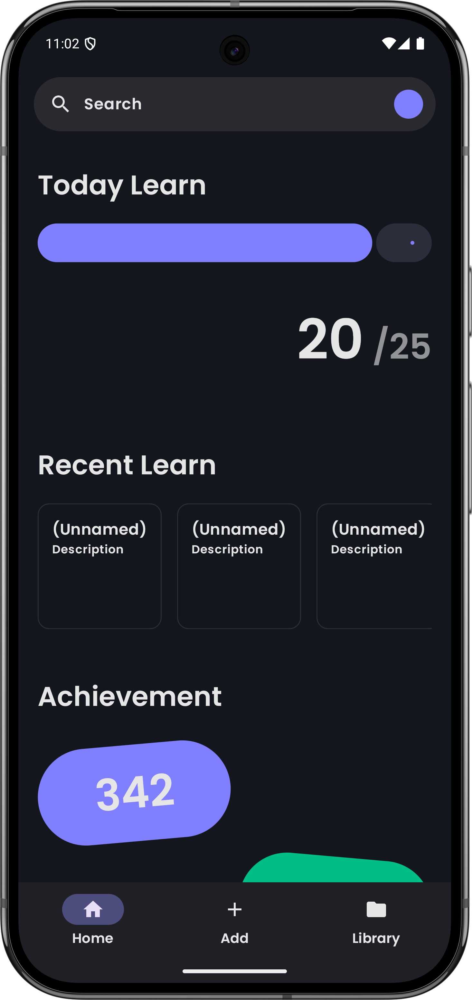
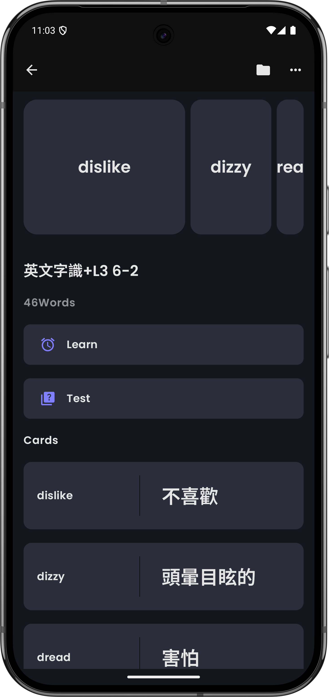
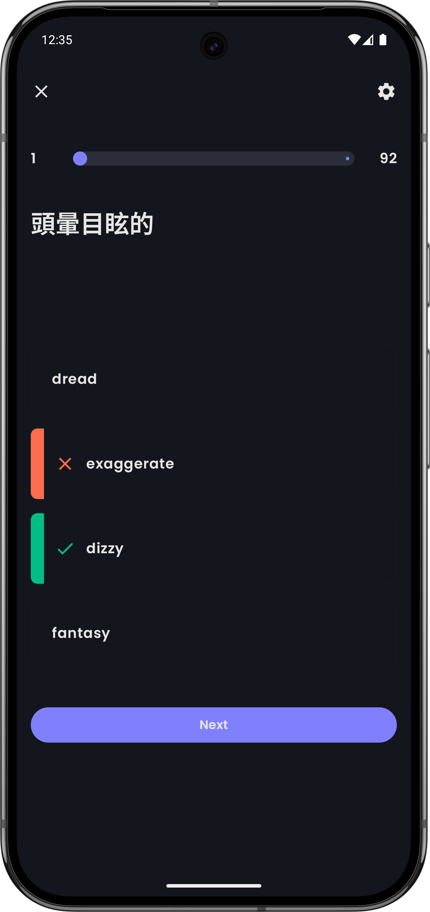

<h1>Lexicardio</h1>

  <a href="https://deepwiki.com/andongni0723/Lexicardio">
    

  
  

A native Android vocabulary learning app featuring flashcards and interactive study modes.

  
  
  

## Features
- Material You design for a modern and polished app UI.
- Study modes that make vocabulary learning interactive and effective.
- Import card sets from custom formats such as CSV, TSV, or any delimiter-based format you
prefer.
- Local storage keeps your card sets on your device, so you don’t need to worry about data loss.
- Daily learning tracking helps keep your motivation and study momentum high.

## Tech Stack
- **Kotlin**: Built with 100% Kotlin.
- **Jetpack Compose**: Used to build the entire UI.
- **Material Design 3**: Provides the design system and UI guidelines for the app.
- **Navigation Compose**: Handles in-app navigation and routing.
- **Hilt**: Manages dependency injection.
- **DataStore**: Persists user preferences locally.
- **Android TextToSpeech**: Plays word pronunciation audio (currently English only).

## Usage

Get the latest package in [Release](https://github.com/andongni0723/Lexicardio/releases/latest/)